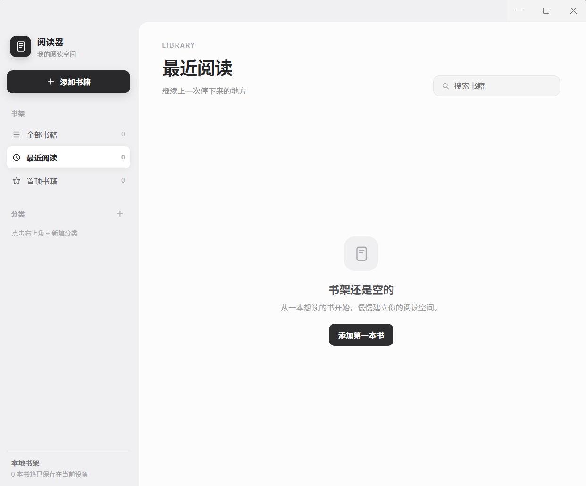

# 阅读器

一个安静、专注的桌面阅读器，支持本地书籍管理、阅读进度、书签、标注与多种电子书格式。



## 下载与使用

### 方式一：下载发布版安装包（推荐）

适合 Windows x64 用户。[下载 Electron v1.0.0 安装包](https://github.com/MF-77F4/reader/releases/download/v1.0.0/reader-1.0.0-windows-x64-setup.exe)，下载后双击安装。版本说明见 [GitHub Release](https://github.com/MF-77F4/reader/releases/tag/v1.0.0)。

> 此安装包未签名，对应源码提交 `e29eaf9`，不包含之后的老板键和进度修复。需要最新代码请使用源码构建方式；Tauri 版本尚未发布。

### 方式二：从源码构建

适合开发者，需预先安装 [Node.js](https://nodejs.org/)（建议 LTS）和 pnpm。

```powershell
git clone https://github.com/MF-77F4/reader.git
cd reader
pnpm install
pnpm build:win:unsigned
```

构建完成后，Windows 安装程序位于 `dist` 目录。若只想在开发模式下启动应用：

```powershell
pnpm dev
```

## Tauri 2 迁移（开发中）

项目保留 Electron 版本，同时正在开发 Tauri 2 版本，迁移时保持阅读、分页、标注、高亮、书签和进度行为一致。架构和阶段计划见 [迁移文档](docs/TAURI_REWRITE_PLAN.md)。Tauri 版本尚未开发完成，当前面向用户的安装包仅提供 Electron 版。

## 开发环境

推荐使用 VS Code，搭配 ESLint、Prettier 和 Vue 插件。在包含 `package.json` 的目录运行命令；当前本机目录为 `E:\reader\reader`，不是外层的 `E:\reader`。

```powershell
pnpm install
pnpm dev
```

以上启动 Electron 版本。开发中的 Tauri 桌面版本可使用：

```powershell
pnpm dev:tauri
# 仅验证和构建 Tauri 前端
pnpm build:tauri:web
# 构建 Tauri 可执行文件，不生成安装器（仅开发测试）
pnpm tauri build --no-bundle
```

### 键盘快捷键

| 快捷键 | 功能 |
| --- | --- |
| 上 / 下方向键 | 滚动模式下滚动正文 |
| 左 / 右方向键 | 分页模式下翻到上一页 / 下一页 |
| 空格 | 分页模式下翻到下一页 |
| Esc | 关闭最上层的弹窗、标注面板、侧栏或菜单 |
| F12（默认） | 老板键：隐藏阅读器，再按一次恢复并聚焦 |

Electron 老板键在窗口显示且未最小化时尝试注册为全局快捷键，因此切换到其他软件后也可触发，无需鼠标悬停。手动最小化时释放，恢复窗口或重新聚焦时重新尝试注册。通过老板键隐藏时保留注册，以便再次按键恢复；关闭窗口或退出时释放。

可在阅读设置中更换老板键。系统不允许抢占其他程序已注册的快捷键；发生冲突时请关闭占用程序或改用组合键（例如 Ctrl+Shift+F12）。更换失败会保留原快捷键。Tauri 桌面端已接入相同的最小化释放与恢复重试逻辑，仍需实机回归；Android 和 iOS 不启用老板键。

### Tauri 的 Windows 工具链

需要 Rust、Microsoft C++ Build Tools、Windows SDK 和 WebView2 运行时，无需安装完整 Visual Studio IDE。本机工具链位于 `E:\reader\.devtools`，项目脚本及 VS Code 终端配置从中加载 Rust、Cargo、JDK、Gradle、Android SDK 和构建缓存。其他机器需按自己的环境调整这些路径。

### Android（开发中）

当前开发环境使用 JDK 21、Android SDK API 36、Build Tools 35/36、NDK 29 和四种 Rust Android 目标。生成 Android 项目后应用 Windows 路径兼容配置：

```powershell
pnpm init:android
pnpm configure:android
pnpm build:android:debug
pnpm build:android:release
```

Windows 用户目录包含非 ASCII 字符，或项目与 Cargo 注册表位于不同磁盘时，需要运行 `configure:android`。该脚本禁用不兼容的 Kotlin 增量路径处理，并指向项目内的 Tauri CLI。
调试命令生成供模拟器使用的 x86_64 APK；发布命令生成面向实体设备的 ARM64 包。这些命令仅供开发使用，目前不发布 Android 安装包。

### Electron 打包

构建和运行均不需要 Python。各平台版本应在对应操作系统上构建：

```powershell
# Windows
pnpm build:win
# Windows 本地无签名安装包
pnpm build:win:unsigned
# macOS
pnpm build:mac
# Linux
pnpm build:linux
```

Electron 安装包不包含 Tauri 源码及其编译产物。
